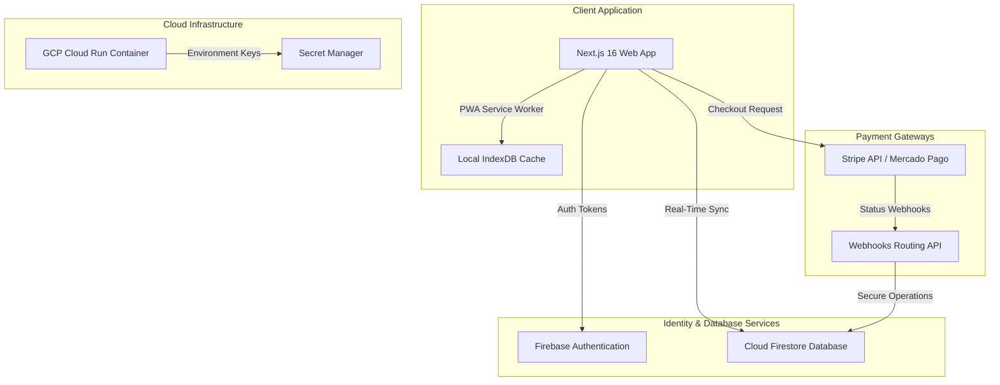
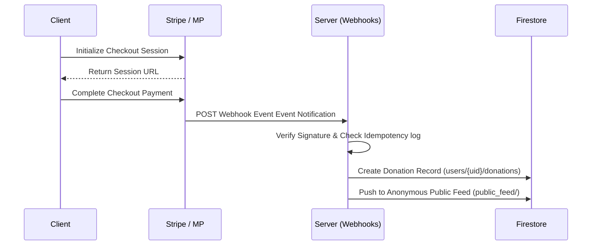

# TechMission Rio — System Architecture & Data Flows

This document details the software architecture, database structures, integration pipelines, and cloud hosting infrastructure of the TechMission Rio platform.

---

## 🏗️ 1. High-Level System Architecture

---

## 🔑 2. Authentication Flow

1. **User Sign-In / Registration**:
   - Google Sign-In or Email/Password credentials processed via Firebase Client SDK.
2. **Access Control Tokens**:
   - Client retrieves JSON Web Token (JWT) credentials from Firebase Authentication.
3. **Role Gating Middleware**:
   - API endpoints verify incoming Authorization headers containing ID tokens using the `firebase-admin` SDK verifying role attributes.

---

## 💳 3. Payment & Webhooks Sync Pipeline

---

## 💾 4. Firestore Core Database Collections Schema

### `users/{uid}`
- `name`: string
- `email`: string
- `profileType`: "individual" | "organization" | "fellow"
- `isAdmin`: boolean
- `fellowId`: string (optional reference link to fellows document)

### `fellows/{fellowId}`
- `name`: string
- `track`: "Web Development" | "UI/UX Design" | "Data Science"
- `bio`: { en: string, pt: string }
- `skills`: array of strings
- `goal`: string
- `videoUrl`: string (YouTube embed link)
- `isEndorsed`: boolean

### `public_feed/{feedItemId}`
- `city`: string
- `country`: string
- `amountTier`: number
- `displayText`: string
- `createdAt`: timestamp

### `sessions/{sessionId}`
- `studentUid`: string
- `mentorUid`: string
- `scheduledAt`: string (ISO date string)
- `zoomLink`: string
- `provider`: "zoom" | "jitsi"
- `status`: "scheduled" | "completed" | "cancelled"
- `matchId`: string

### `matches/{matchId}`
- `studentId`: string
- `mentorUid`: string
- `matchedAt`: timestamp
- `matchScore`: number
- `status`: "pending" | "confirmed" | "completed"

---

## 📲 5. PWA Caching Strategy

The Progressive Web App utilizing custom service workers implements decoupling strategies:
- **Cache First**: Static assets (fonts, icons, stylesheets) are pre-cached.
- **Network First with Offline Fallback**: Interactive routes (`/fellows`, `/donate`, `/roadmap`) attempt network checks first, rendering the dynamic cache or the offline page banner on failures.
