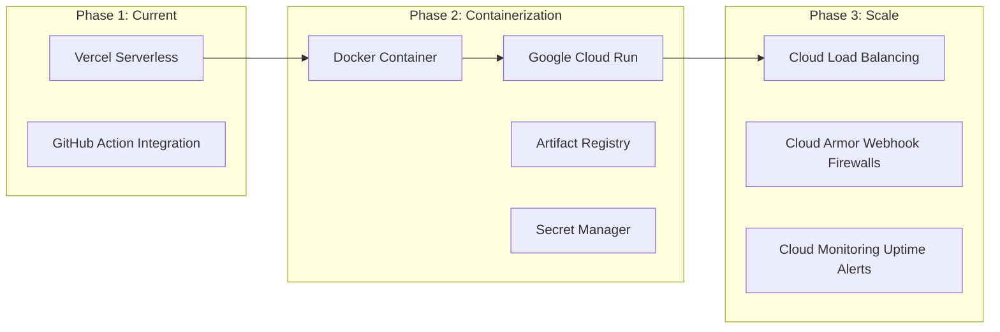

# 🚀 TechMission Rio: Master Product & Marketing Plan

> [!IMPORTANT]
> **North Star Statement**
> Build the most trusted technology talent pipeline connecting underserved youth in Rio de Janeiro with global educational, mentorship, and employment opportunities through transparent, scalable, and accessible technology.

---

## 🎯 Strategic Principles

### Product Principles
Every feature must satisfy one or more of the following:
- **Increase donor trust**: Deliver strict transparency on budgets and metrics.
- **Improve student opportunity**: Secure access to hardware, curriculum, and native US mentorship.
- **Reduce operational burden**: Automate invitations, role gates, and webhook transactions.
- **Remain accessible on low-bandwidth connections**: Ensure offline resilience via cache fallbacks.
- **Be maintainable by a small engineering team**: Keep dependencies low and serverless slots clean.

### Engineering Principles
- **Mobile-first** design workflows.
- **Accessibility-first** targets (WCAG 2.2 AA target).
- **API-first** decoupled server designs.
- **Serverless where practical** to avoid infrastructure hosting costs.
- **Progressive enhancement** via local sync queues and offline recovery.
- **Performance before animation** to optimize mobile bandwidth rendering.
- **Security by default** via Firebase Admin ID token verifications.
- **Cloud portable architecture** using standardized API interfaces.

---

## 📅 Part 1: The 6-Month Marketing & Outreach Plan

Our marketing strategy targets two primary stakeholders: **US Christian Churches/Organizations** (funding & mentorship) and **Rio de Janeiro Technical Schools** (student pipeline).

```
  MONTH 1-2                 MONTH 3-4                 MONTH 5-6
  [Pipeline & Mentors]     [B2B Church Outreach]     [Missions & Retention]
  * FAETEC & IFRJ pilots   * Direct B2B Campaigns    * Rio Tech Summer Camps
  * BRASA chapters drive   * Youth-Group Exchanges   * Annual Impact Report
```

### 🔹 Months 1–2: Student Pipeline Sourcing
* **Rio School Partnerships**: Cooperation agreements with **FAETEC** (Santa Cruz & Quintino) and **IFRJ** (Rio de Janeiro & Duque de Caxias) campuses. IT teachers nominate the top 10% highest-potential, low-income students.
* **US University Mentorship Drive**: Partner with BRASA chapters at top US technical universities (MIT, Stanford, Georgia Tech, Harvard) to recruit bilingual tech mentors.

### 🔹 Months 3–4: B2B Christian Organization & Church Campaigns
* **Classroom Sponsorship**: Package TMR as an "Adopt-a-Classroom" cohort sponsorship (sponsoring 12 students' laptops and 6 months of training for $12,000).
* **Digital Campaign**: Distribute impact video series showing Rio fellows receiving laptops and coding workshops.

### 🔹 Months 5–6: Rio Mission Trips & Donor Retention Loop
* **Missions Trip Collaboration**: Run in-person Tech Missions trips where US church teams travel to Rio to co-host coding camps with local churches.
* **Annual Impact & Transparency**: Publish the automated Annual Impact Report detailing where every dollar was spent, laptop serial numbers, and student graduation outcomes.

---

## 📊 Success Metrics & KPIs

To validate if new features create value, the platform evaluates operations against these target success metrics:

| Metric | Target Goal |
| :--- | :--- |
| **First-Time Donor Conversion** | 8% |
| **Monthly Recurring Donors** | 30% of active donor base |
| **Average Donation Size** | $75.00 USD |
| **Student Nominations Sourced** | 100 / year |
| **Bilingual Mentor Matches** | 50 / year |
| **Student Career Placement Rate** | 70% within 6 months of completion |
| **Email Open Rate** | 45% on automated newsletters |
| **PWA App Installs** | 500 standalone installations |

---

## 🏗️ Data Architecture Flow

```mermaid
graph TD
    A[Client App: Next.js 14] -->|Session Authentication| B[GCP Firebase Auth]
    A -->|Live Metrics listeners| C[Cloud Firestore]
    A -->|Anonymized Event Tracking| D[PostHog Analytics]
    A -->|Initialize Checkout| E[Stripe Gateway API]
    E -->|Secure Redirect| F[Stripe Checkout Pages]
    F -->|Payment Events| G[Next.js Stripe Webhook API]
    G -->|Write Donations / Seeding| C
    C -->|Trigger Notification / Receipt| H[Firebase Trigger Email (Trigger Email Extension)]
    I[Admin Dashboard Control] -->|Auditing / Nominations| C
    J[Student Video Uploads] -->|YouTube embed| K[YouTube Embed Links]
```

*Note on storage architecture:*
- **Videos**: YouTube embeds are used directly in candidate cards (no Google Cloud Storage is used for video).
- **Receipts**: PDFs are generated dynamically on-demand from transaction records, not stored persistently in Google Cloud Storage.

---

## 🐳 CI/CD Deployment Flow

```
Developer ➔ Local Git Commit ➔ GitHub Pull Request ➔ Vercel Preview Deploy ➔ QA Review / Approval ➔ Merge to main ➔ Production Release ➔ PostHog Analytics Monitor ➔ Cloud Monitoring Alerts
```

---

## 🗃️ Firestore Collections Schema

* **`users/`**: Standard client accounts (email, names, metadata, roles, associated fellow/organization ID references).
* **`fellows/`**: pre-seeded student profiles (academic tracks, biografic details, linked auth userIds, video pitch URLs).
* **`donations/`**: Sub-collections under users mapping transactions, payment dates, B2B status, and receipts.
* **`schools/`**: School coordinates, maps pins, active class sizes, and hardware metrics.
* **`organizations/`**: B2B church/corporate entities, cohort sponsorship flags, and prayer encouragement walls.
* **`nominations/`**: Educator nomination documents (student details, technical justifications, approval status).
* **`notifications/`**: Event alert items, system logs, and delivery states.
* **`public_feed/`**: Opt-in anonymous donor city feed items (city, country, amountTier, displayText, createdAt) - populated by Stripe webhook. Public read-only.
* **`sessions/`**: Scheduled mentor-student video sessions (studentUid, mentorUid, scheduledAt, zoomLink or meetLink, status: "scheduled"|"completed"|"cancelled", matchId).
* **`matches/`**: Confirmed AI mentor-student pairings (studentId: fellows/{id}, mentorUid, matchedAt, matchScore, status: "pending"|"confirmed"|"completed").
* **`stripe_events/`**: Idempotency guard for webhook deduplication (processedAt: Timestamp).
* **`mail/`**: Firebase Trigger Email queue (to, template: {name, data}).
* **`device_tokens/{uid}/tokens/`**: FCM push tokens (token, platform, createdAt).
* **`chats/{chatId}/messages/`**: Student-mentor chat messages (senderUid, text, createdAt, readBy[]).

---

## 📦 Repository Structure

* **`app/`**: Next.js App Router components, server actions, and layouts.
* **`components/`**: Reusable components (Navigation, Forms, Alert Banners).
* **`lib/`**: Firebase client instantiations, server SDK admin setups, and payment configs.
* **`hooks/`**: Custom React states hooks (Auth context, analytics hooks).
* **`public/`**: Manifest definitions, PWA icons, dynamic SVG vector logos, and offline fallbacks.
* **`docs/`**: Strategic plans, debugging guidelines, and repository notes.
* **`scripts/`**: PWA asset converters and local compile runners.

---

## 🖼️ Media Optimization & Cloud Storage

To maintain premium Lighthouse scores and fast initial loads in favelas, files process through this pipeline:

```
Camera/Photo Capture ➔ Client Optimize (Compression) ➔ GCP Storage Upload ➔ CDN Cache Layer ➔ Next.js Image Optimization Component ➔ Browser Storage Cache
```

Cloud Storage maintains all core binary datasets:
* **Student Photos**: Crop compressed image thumbnails.
* **Pitch Videos**: Standalone elevator pitches and backup files.
* **Student Portfolios**: PDF resume files and portfolio snapshots.
* **B2B Pitch Decks**: Strategic PDFs for church/angel reviews.
* **Donation Receipts**: Automated tax PDF archives for B2B accounts.

---

## 🗺️ Product Roadmap & Milestones

### 1. COMPLETED (Months 1 – 4)
* **Donations Engine**: USD processing via Stripe. (Local BRL PIX integration deferred to v3.1; current Brazilian donor volume does not justify integration complexity. Revisit when monthly BRL donation attempts exceed 20/month.)
* **Authentication**: Credentials database & single-tap **Google Sign-In**.
* **Dynamic Gateway Routing**: Dynamic gate at `/dashboard` routing admins, donors, and fellows.
* **LGPD Minor Protections**: Mandatory parent permission verification under Brazilian LGPD Art. 14.
* **Teacher Endorsement Badge**: Verified trust signal for roster profiles.
* **Installable PWA**: Registered service worker (`sw.js`) with Cache First, Stale While Revalidate, and Network First with Offline Fallback strategies. Custom branded `/offline` session recovery screens.
* **B2B Sponsored Classroom Dashboard**: educators check hardware requests and review submitted nominations in real time; sponsors view student rosters and elevator pitch videos.

### 2. FUTURE ROADMAP (Months 5 – 6 & Backlog)
* **FCM Push Notification Service Worker** (Month 5).
* **i18n Translation Switcher**: Bilingual EN/PT toggles for headers, footers, and dynamically updated databases (Month 6).
* **Tax-exempt receipts generator** for US B2B partners.
* **Volunteer & Alumni Pipeline**: Tools for corporate matchings and employer pipelines.

---

## 🎓 2027 Vision (Scaling Targets)
* **Active Fellows**: 500 tech candidates.
* **Partner Schools**: 50 active campuses in Rio de Janeiro.
* **US Tech Mentors**: 100 onboarded mentors.
* **Donors Pool**: 1,000 active individual and organizational sponsors.
* **Corporate Internship Networks**: Direct hiring pathways in Rio/US tech sectors.
* **Mobile App Releases**: Google Play and iOS App Store native builds.
* **AI Interview Platforms**: Standalone mock tech interviews and resume reviews.

---

## 🏆 Product Maturity Model

| Stage | Primary Goal |
| :--- | :--- |
| **1. Foundation** (Completed) | Ship core functionality (payments, auth, dashboards) and validate. |
| **2. Validation** (Current) | Onboard first donors, technical fellows, and schools; test flows. |
| **3. Optimization** (Future) | Run A/B tests, improve conversion, retain cohorts, optimize offline loads. |
| **4. Scale** (Backlog) | Containerize infrastructure, automate processes, expand technical schools network. |

---

## ⚠️ Risk Registry & Mitigations

* **Limited Donor Acquisition**: Mitigated by B2B Adopt-a-Classroom packages and church outreach drives.
* **Stripe Transaction Fee Changes**: Mitigated by providing fallback local BRL channels (Mercado Pago / direct banks).
* **LGPD Regulatory Updates**: Checked by mandatory parent verification inputs and explicit consent gates.
* **Volunteer / Mentor Retention**: Mitigated by partnering with BRASA chapters and automating syncs.
* **API Pricing Overages**: Mitigated by client-only rule engines and lazy analytics triggers.
* **Zoom/Meta API approval delays**: Mitigated by starting marketplace submissions 4+ weeks before Sprint 15 and 14. Fallback: Jitsi for video rooms, static social links for feeds.
* **OpenAI cost overruns**: Mitigated by $50/month hard cap in OpenAI dashboard. Monitor via usage dashboard weekly.

---

## 💼 Disaster Recovery & Business Continuity

* **Firestore Backups**: Scheduled daily database backup dumps to GCP Bucket.
* **Secret Rotation**: Quarterly rotation policies for Stripe keys, service accounts, and API signatures.
* **Domain Recovery**: Ownership handles registered to non-personal trust entities.
* **Stripe Failover**: Direct bank PIX fallback guides for donors if cards processing fails.

---

## 🏛️ Governance & Partnerships

* **Board of Directors**: Strategic non-profit oversight.
* **Advisory Councils**: US technology leaders and theological advisors.
* **Educational Partners**: FAETEC, IFRJ, and Rio public high schools.
* **Corporate Sponsors**: Technology firms and NGO matching foundations.
* **Volunteers**: Bilingual university student mentors and trip coordinators.

---

## 🔒 Security & Compliance Roadmap

* **Firestore Security Rules**: Tighten rules to ensure users can only write/read profiles matching their authenticated UID.
* **Role-Based Access Control**: Gate API endpoints (e.g. nomination mutations) to processes authenticated under process env `ADMIN_UID`.
* **Rate Limiting**: Integrate middleware filters to mitigate automated query spamming on forms.

---

## 👁️ Observability & Monitoring

* **Error Tracking**: Deploy client/server error trackers (e.g., Sentry) to log exceptions in real-time.
* **Webhook Audits**: Log Stripe event idempotency IDs inside Firestore to prevent double payment records.

---

## 🐳 Infrastructure: Cloud Run Migration Plan



---

## ♿ Accessibility Target (WCAG 2.2 AA Compliance)

TMR prioritizes accessibility as a first-class product objective:
* **Contrast Controls**: High-contrast dark themes supporting low-vision users.
* **Keyboard Flow**: Native tab flows with visible focus indicators.
* **Semantic HTML & Aria Labels**: Clear labels on forms and action links.

---

## 🤖 Future AI Integration Backlog

AI acts as a supporting capability rather than the product itself:
* **OpenAI Cohort Matcher**: Simple rules engine for default tiers, invoking LLMs to match donors with student bios on specific tags.
* **Interview Practice Simulator**: Chatbots giving fellows automated feedback on software engineer resumes.

---

## 📅 Part 3: Phase 5 Sprints Roadmaps (Next Master Plan)

### 🚀 Release v3.0 — Advanced Engagement & Integrations

#### ⚡ Sprint 13: Live Impact Maps & Donor Feed (Weeks 17–18)
* Geolocated anonymous map on `/impact` showing donor cities and church hubs.
* Live feed ticket displaying recent donor locations and laptop counts.

#### ⚡ Sprint 14: Social Media Integrations & Annual Impact Report (Weeks 19–20)
* Direct integrations with Instagram & Facebook media updates feeds.
* Share overlay integrations for student profile stories on TikTok/Instagram.
* **Annual Impact Report**:
  - Generate annual impact PDF dynamically from Firestore data (total donations, laptops distributed, fellows approved, nomination count, school partners).
  - Add manually triggerable button inside the Admin Dashboard.
  - Automate email delivery of this PDF to all active donors via the Firebase Trigger Email queue.

#### ⚡ Sprint 15: Automated Video Room & Zoom Scheduler (Weeks 21–22)
* Google Calendar & Zoom API scheduling for matched students/mentors.
* Interactive calendar dashboard widget in student/mentor portals.

#### ⚡ Sprint 16: AI Resume Screeners & Practice Board (Weeks 23–24)
* Automated PDF resume analyzers and rating gauges.
* Interactive mock technical interview chatbots.
