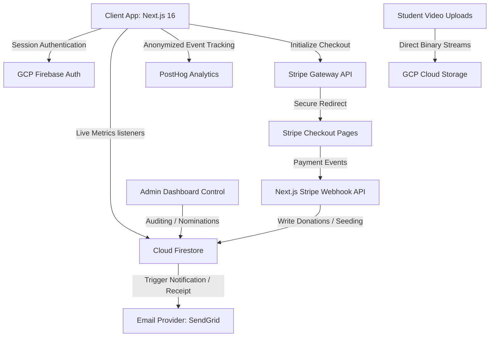
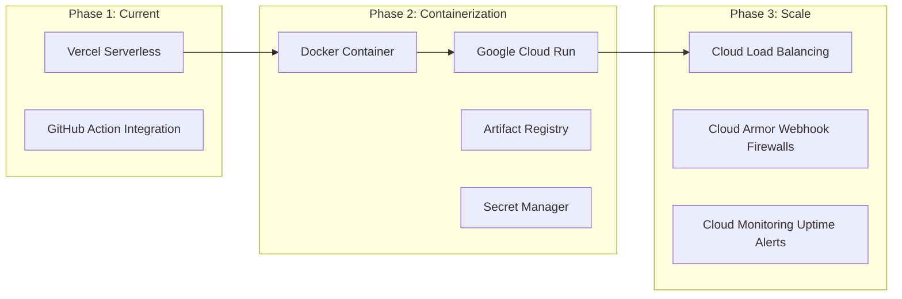

# 🚀 TechMission Rio: Master Product & Marketing Plan

> [!IMPORTANT]
> **North Star Statement**
> Build the most trusted technology talent pipeline connecting underserved youth in Rio de Janeiro with global educational, mentorship, and employment opportunities through transparent, scalable, and accessible technology.

---

## 📅 Part 1: The 6-Month Marketing & Outreach Plan

Our marketing strategy targets two primary stakeholders: **US Christian Churches/Organizations** (funding & mentorship) and **Rio de Janeiro Technical Schools** (student pipeline).

```
  MONTH 1-2                 MONTH 3-4                 MONTH 5-6
  [Pipeline & Mentors]     [B2B Church Outreach]     [Missions & Retention]
  * FAETEC & IFRJ pilots   * Direct B2B Campaigns    * Rio Tech Summer Camps
  * BRASA chapters drive   * Youth-Group Exchanges   * Annual Impact Report
```

### 🔹 Months 1–2: Student Pipeline Sourcing
* **Rio School Partnerships**: Cooperation agreements with **FAETEC** (Santa Cruz & Quintino) and **IFRJ** (Rio de Janeiro & Duque de Caxias) campuses. IT teachers nominate the top 10% highest-potential, low-income students.
* **US University Mentorship Drive**: Partner with BRASA chapters at top US technical universities (MIT, Stanford, Georgia Tech, Harvard) to recruit bilingual tech mentors.

### 🔹 Months 3–4: B2B Christian Organization & Church Campaigns
* **Classroom Sponsorship**: Package TMR as an "Adopt-a-Classroom" cohort sponsorship (sponsoring 12 students' laptops and 6 months of training for $12,000).
* **Digital Campaign**: Distribute impact video series showing Rio fellows receiving laptops and coding workshops.

### 🔹 Months 5–6: Rio Mission Trips & Donor Retention Loop
* **Missions Trip Collaboration**: Run in-person Tech Missions trips where US church teams travel to Rio to co-host coding camps with local churches.
* **Annual Impact & Transparency**: Publish the automated Annual Impact Report detailing where every dollar was spent, laptop serial numbers, and student graduation outcomes.

---

## 📊 Success Metrics & KPIs

To validate if new features create value, the platform evaluates operations against these target success metrics:

| Metric | Target Goal |
| :--- | :--- |
| **First-Time Donor Conversion** | 8% |
| **Monthly Recurring Donors** | 30% of active donor base |
| **Average Donation Size** | $75.00 USD |
| **Student Nominations Sourced** | 100 / year |
| **Bilingual Mentor Matches** | 50 / year |
| **Student Career Placement Rate** | 70% within 6 months of completion |
| **Email Open Rate** | 45% on automated newsletters |
| **PWA App Installs** | 500 standalone installations |

---

## 🏗️ Data Architecture Flow



---

## 🖼️ Media Optimization Asset Pipeline

To maintain premium lighthouse scores and fast initial loads in favelas, files process through this pipeline:

```
Camera/Photo Capture ➔ Client Optimize (Compression) ➔ GCP Storage Upload ➔ CDN Cache Layer ➔ Next.js Image Optimization Component ➔ Browser Storage Cache
```

---

## 🗺️ Product Roadmap & Milestones

### 1. COMPLETED (Months 1 – 4)
* **Donations Engine**: USD and local BRL checkout processing via Stripe/PIX.
* **Authentication**: Credentials database & single-tap **Google Sign-In**.
* **Dynamic Gateway Routing**: Dynamic gate at `/dashboard` routing admins, donors, and fellows.
* **LGPD Minor Protections**: Mandatory parent permission verification under Brazilian LGPD Art. 14.
* **Teacher Endorsement Badge**: Verified trust signal for roster profiles.
* **Installable PWA**: Registered service worker (`sw.js`) with Cache First, Stale While Revalidate, and Network First with Offline Fallback strategies. Custom branded `/offline` session recovery screens.
* **B2B Sponsored Classroom Dashboard**: educators check hardware requests and review submitted nominations in real time; sponsors view student rosters and elevator pitch videos.

### 2. FUTURE ROADMAP (Months 5 – 6 & Backlog)
* **FCM Push Notification Service Worker** (Month 5).
* **i18n Translation Switcher**: Bilingual EN/PT toggles for headers, footers, and dynamically updated databases (Month 6).
* **Tax-exempt receipts generator** for US B2B partners.
* **Volunteer & Alumni Pipeline**: Tools for corporate matchings and employer pipelines.

---

## 🔒 Security & Compliance Roadmap

* **Firestore Security Rules**: Tighten rules to ensure users can only write/read profiles matching their authenticated UID.
* **Role-Based Access Control**: Gate API endpoints (e.g. nomination mutations) to processes authenticated under process env `ADMIN_UID`.
* **Rate Limiting**: Integrate middleware filters to mitigate automated query spamming on forms.

---

## 👁️ Observability & Monitoring

* **Error Tracking**: Deploy client/server error trackers (e.g., Sentry) to log exceptions in real-time.
* **Webhook Audits**: Log Stripe event idempotency IDs inside Firestore to prevent double payment records.

---

## 🐳 Infrastructure: Cloud Run Migration Plan



---

## ♿ Accessibility Target (WCAG 2.2 AA Compliance)

TMR prioritizes accessibility as a first-class product objective:
* **Contrast Controls**: High-contrast dark themes supporting low-vision users.
* **Keyboard Flow**: Native tab flows with visible focus indicators.
* **Semantic HTML & Aria Labels**: Clear labels on forms and action links.

---

## 🤖 Future AI Integration Backlog

AI acts as a supporting capability rather than the product itself:
* **OpenAI Cohort Matcher**: Simple rules engine for default tiers, invoking LLMs to match donors with student bios on specific tags.
* **Interview Practice Simulator**: Chatbots giving fellows automated feedback on software engineer resumes.
